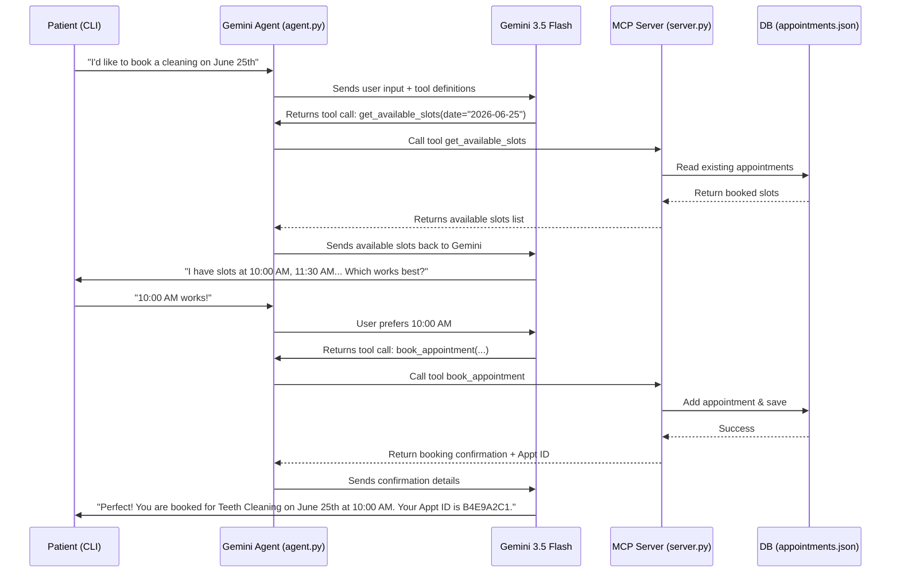

# 🦷 Dental Clinic Booking Agent

An interactive conversational booking assistant built using **Python**, **Gemini 3.5 Flash**, and the **Model Context Protocol (MCP)**. 

The agent acts as **Pearl**, a professional and friendly receptionist at *Bright Smile Dental Clinic*, capable of managing appointments, providing pricing, and checking availability in real time using local MCP tools.

---

## 🏗️ Architecture & Flow

This project implements a local client-server architecture using the **Model Context Protocol (MCP)**:



---

## 📂 Project Structure

- [requirements.txt](file:///C:/Users/safiullah%20khan/dental-booking-agent/requirements.txt): Lists Python dependencies (`google-genai`, `mcp`, `fastmcp`, `python-dotenv`).
- [server.py](file:///C:/Users/safiullah%20khan/dental-booking-agent/server.py): The FastMCP server containing the booking database operations, availability computations, and receptionist tools.
- [agent.py](file:///C:/Users/safiullah%20khan/dental-booking-agent/agent.py): The Gemini 3.5 Flash agent client which launches the MCP server, negotiates tools, and processes conversation loops.
- [appointments.json](file:///C:/Users/safiullah%20khan/dental-booking-agent/appointments.json) *(auto-generated)*: Stores appointment schedules.
- [.env.example](file:///C:/Users/safiullah%20khan/dental-booking-agent/.env.example): Template for environment variables.

---

## 🛠️ MCP Tools Offered

The MCP Server exposes the following functions directly to Gemini:

1. **`get_clinic_info`**: Retrieves clinic hours, contact details, services offered, pricing, and appointment durations.
2. **`get_available_slots`**: Validates a date (`YYYY-MM-DD`) and computes open 30-minute intervals by checking existing bookings.
3. **`book_appointment`**: Inserts a new appointment records checking for calendar conflicts. Returns a confirmation with an 8-character ID.
4. **`get_appointment`**: Looks up full details of an active appointment by ID.
5. **`cancel_appointment`**: Marks an existing booking as cancelled.
6. **`find_appointments_by_phone`**: Queries all appointments associated with a specific phone number.

---

## 🚀 Setup & Execution

### 1. Prerequisites
- **Python 3.10+** must be installed on your system.

### 2. Installation
Navigate to this project directory in your terminal and install dependencies:
```bash
pip install -r requirements.txt
```

### 3. Configuration
Copy [.env.example](file:///C:/Users/safiullah%20khan/dental-booking-agent/.env.example) to `.env`:
```bash
copy .env.example .env
```
Open `.env` and configure your API key:
```env
GEMINI_API_KEY=AIzaSy...
```

### 4. Running the Agent
Run the agent script using:
```bash
python agent.py
```

---

## 💬 Sample Interaction

```text
Connecting to MCP server...
MCP connection established.
Registered 6 tools from MCP server.

==================================================
Pearl (Dental Receptionist) is now online.
Type 'exit' or 'quit' to end the session.
==================================================

Pearl: Hello! Welcome to Bright Smile Dental Clinic. My name is Pearl. How can I assist you with your dental needs today?

You: What services do you offer and what are your opening hours?
  [Tool Call: get_clinic_info | Args: {}]

Pearl: At Bright Smile Dental Clinic, we offer the following services:
- Teeth Cleaning & Polish ($95, 30 mins)
- Dental Filling ($150, 45 mins)
- Teeth Whitening ($299, 60 mins)
- Root Canal Therapy ($850, 90 mins)
- General Consultation & X-Ray ($60, 30 mins)

We are open:
- Monday to Friday: 9:00 AM to 5:00 PM
- Saturday: 9:00 AM to 1:00 PM
- Sunday: Closed

How can I help you today?

You: I want to book a whitening session for next Monday, June 22nd. My name is Safiullah and my phone is 555-987-6543.
  [Tool Call: get_available_slots | Args: {'date_str': '2026-06-22'}]

Pearl: I'd be happy to help you with that, Safiullah! For next Monday, June 22nd, I have the following available slots for Teeth Whitening:
- 09:00 AM
- 10:00 AM
- 11:30 AM
- 02:00 PM
- 03:30 PM

Do any of these times work for you?

You: Let's do 10:00 AM.
  [Tool Call: book_appointment | Args: {'date_str': '2026-06-22', 'patient_name': 'Safiullah', 'patient_phone': '555-987-6543', 'service_key': 'whitening', 'time_str': '10:00 AM'}]

Pearl: Excellent choice! I've booked your Teeth Whitening session. Here are the confirmation details:
- **Patient**: Safiullah
- **Service**: Teeth Whitening
- **Date**: Monday, June 22nd, 2026
- **Time**: 10:00 AM
- **Price**: $299
- **Appointment ID**: E6B7D3F9

Please keep this Appointment ID handy in case you need to change or cancel your appointment. We look forward to seeing you!
```
